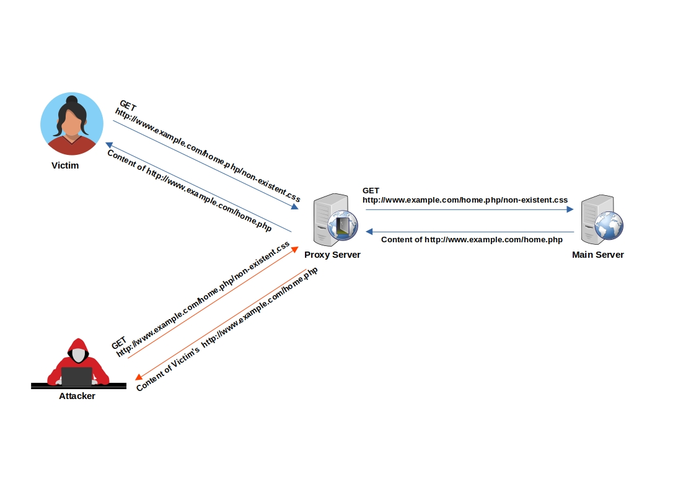

# Web Cache Deception

> Web Cache Deception (WCD) is a security vulnerability that occurs when a web server or caching proxy misinterprets a client's request for a web resource and subsequently serves a different resource, which may often be more sensitive or private, after caching it.


## Summary

* [Tools](#tools)
* [Methodology](#methodology)
    * [Caching Sensitive Data](#caching-sensitive-data)
    * [Caching Custom JavaScript](#caching-custom-javascript)
* [CloudFlare Caching](#cloudflare-caching)
* [Labs](#labs)
* [References](#references)


## Tools

* [PortSwigger/param-miner](https://github.com/PortSwigger/param-miner) - Web Cache Poisoning Burp Extension


## Methodology

Example of Web Cache Deception: 

Imagine an attacker lures a logged-in victim into accessing `http://www.example.com/home.php/non-existent.css`

1. The victim's browser requests the resource `http://www.example.com/home.php/non-existent.css`
2. The requested resource is searched for in the cache server, but it's not found (resource not in cache). 
3. The request is then forwarded to the main server. 
4. The main server returns the content of `http://www.example.com/home.php`, most probably with HTTP caching headers that instruct not to cache this page. 
5. The response passes through the cache server. 
6. The cache server identifies that the file has a CSS extension. 
7. Under the cache directory, the cache server creates a directory named home.php and caches the imposter "CSS" file (non-existent.css) inside it. 
8. When the attacker requests `http://www.example.com/home.php/non-existent.css`, the request is sent to the cache server, and the cache server returns the cached file with the victim's sensitive `home.php` data.




### Caching Sensitive Data

**Example 1** - Web Cache Deception on PayPal Home Page

1. Normal browsing, visit home : `https://www.example.com/myaccount/home/`
2. Open the malicious link : `https://www.example.com/myaccount/home/malicious.css`
3. The page is displayed as /home and the cache is saving the page
4. Open a private tab with the previous URL : `https://www.example.com/myaccount/home/malicious.css`
5. The content of the cache is displayed

Video of the attack by Omer Gil - Web Cache Deception Attack in PayPal Home Page
[](https://vimeo.com/249130093)

**Example 2** - Web Cache Deception on OpenAI

1. Attacker crafts a dedicated .css path of the `/api/auth/session` endpoint.
2. Attacker distributes the link
3. Victims visit the legitimate link.
4. Response is cached.
5. Attacker harvests JWT Credentials.


### Caching Custom JavaScript

1. Find an un-keyed input for a Cache Poisoning
    ```js
    Values: User-Agent
    Values: Cookie
    Header: X-Forwarded-Host
    Header: X-Host
    Header: X-Forwarded-Server
    Header: X-Forwarded-Scheme (header; also in combination with X-Forwarded-Host)
    Header: X-Original-URL (Symfony)
    Header: X-Rewrite-URL (Symfony)
    ```
2. Cache poisoning attack - Example for `X-Forwarded-Host` un-keyed input (remember to use a buster to only cache this webpage instead of the main page of the website)
    ```js
    GET /test?buster=123 HTTP/1.1
    Host: target.com
    X-Forwarded-Host: test"><script>alert(1)</script>

    HTTP/1.1 200 OK
    Cache-Control: public, no-cache
    [..]
    <meta property="og:image" content="https://test"><script>alert(1)</script>">
    ```


## Tricks

The following URL format are a good starting point to check for "cache" feature.

* `https://example.com/app/conversation/.js?test`
* `https://example.com/app/conversation/;.js`
* `https://example.com/home.php/non-existent.css`


## CloudFlare Caching

CloudFlare caches the resource when the `Cache-Control` header is set to `public` and `max-age` is greater than 0. 

- The Cloudflare CDN does not cache HTML by default
- Cloudflare only caches based on file extension and not by MIME type: [cloudflare/default-cache-behavior](https://developers.cloudflare.com/cache/about/default-cache-behavior/)


In Cloudflare CDN, one can implement a `Cache Deception Armor`, it is not enabled by default.
When the `Cache Deception Armor` is enabled, the rule will verify a URL's extension matches the returned `Content-Type`.

CloudFlare has a list of default extensions that gets cached behind their Load Balancers.

|       |      |      |      |      |       |      |
|-------|------|------|------|------|-------|------|
| 7Z    | CSV  | GIF  | MIDI | PNG  | TIF   | ZIP  |
| AVI   | DOC  | GZ   | MKV  | PPT  | TIFF  | ZST  |
| AVIF  | DOCX | ICO  | MP3  | PPTX | TTF   | CSS  |
| APK   | DMG  | ISO  | MP4  | PS   | WEBM  | FLAC |
| BIN   | EJS  | JAR  | OGG  | RAR  | WEBP  | MID  |
| BMP   | EOT  | JPG  | OTF  | SVG  | WOFF  | PLS  |
| BZ2   | EPS  | JPEG | PDF  | SVGZ | WOFF2 | TAR  |
| CLASS | EXE  | JS   | PICT | SWF  | XLS   | XLSX |


Exceptions and bypasses:

* If the returned Content-Type is application/octet-stream, the extension does not matter because that is typically a signal to instruct the browser to save the asset instead of to display it.
* Cloudflare allows .jpg to be served as image/webp or .gif as video/webm and other cases that we think are unlikely to be attacks.
* [Bypassing Cache Deception Armor using .avif extension file - fixed](https://hackerone.com/reports/1391635)


## Labs 

* [PortSwigger Labs for Web Cache Deception](https://portswigger.net/web-security/all-labs#web-cache-poisoning)


## References

- [Cache Deception Armor - Cloudflare - May 20, 2023](https://developers.cloudflare.com/cache/cache-security/cache-deception-armor/)
- [Exploiting cache design flaws - PortSwigger - May 4, 2020](https://portswigger.net/web-security/web-cache-poisoning/exploiting-design-flaws)
- [Exploiting cache implementation flaws - PortSwigger - May 4, 2020](https://portswigger.net/web-security/web-cache-poisoning/exploiting-implementation-flaws)
- [How I Test For Web Cache Vulnerabilities + Tips And Tricks - bombon (0xbxmbn) - July 21, 2022](https://bxmbn.medium.com/how-i-test-for-web-cache-vulnerabilities-tips-and-tricks-9b138da08ff9)
- [OpenAI Account Takeover - Nagli (@naglinagli) - March 24, 2023](https://twitter.com/naglinagli/status/1639343866313601024)
- [Practical Web Cache Poisoning - James Kettle (@albinowax) - August 9, 2018](https://portswigger.net/blog/practical-web-cache-poisoning)
- [Shockwave Identifies Web Cache Deception and Account Takeover Vulnerability affecting OpenAI's ChatGPT - Nagli (@naglinagli) - July 15, 2024](https://www.shockwave.cloud/blog/shockwave-works-with-openai-to-fix-critical-chatgpt-vulnerability)
- [Web Cache Deception Attack - Omer Gil - February 27, 2017](http://omergil.blogspot.fr/2017/02/web-cache-deception-attack.html)
- [Web Cache Deception Attack leads to user info disclosure - Kunal Pandey (@kunal94) - February 25, 2019](https://medium.com/@kunal94/web-cache-deception-attack-leads-to-user-info-disclosure-805318f7bb29)
- [Web Cache Entanglement: Novel Pathways to Poisoning - James Kettle (@albinowax) - August 5, 2020](https://portswigger.net/research/web-cache-entanglement)
- [Web cache poisoning - PortSwigger - May 4, 2020](https://portswigger.net/web-security/web-cache-poisoning)